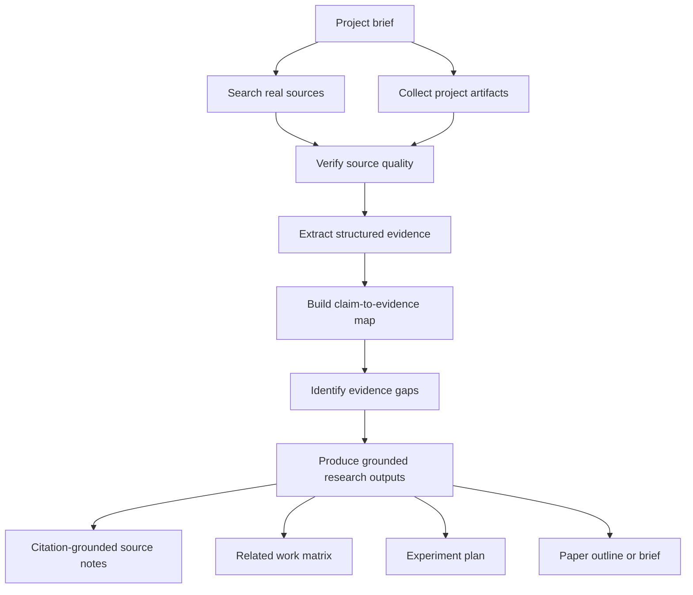

# Sopaper Evidence


Current version: `v0.6-dev`

Sopaper Evidence is an evidence-first research skill for evidence discovery, source verification, and citation grounding. It searches, verifies, and organizes real papers, datasets, benchmarks, case studies, and project artifacts before any downstream research writing or planning work begins.

This project is designed for teams that need defensible research support under reviewer scrutiny. It does not fabricate results, citations, benchmarks, or claims. If evidence is weak or missing, it reports the gap instead of filling it with confident text.

## Why it exists

Most writing-oriented research prompts are good at producing paragraphs and bad at preserving truth. That failure mode is unacceptable for serious research work.

Sopaper Evidence is built around a stricter workflow:

1. Search and collect real sources
2. Verify which sources are primary and which are not
3. Extract structured evidence
4. Map claims to evidence
5. Identify missing experiments and unsupported conclusions
6. Support downstream writing only after the evidence pack is sound

## Who this is for

- research engineers turning projects into evidence-backed narratives
- robotics and embodied systems teams that need fair comparisons
- founders and labs that want research support without weak citations or unsupported claims
- OpenClaw-style projects where method, benchmark, and evidence must stay tightly aligned

## What you get

- an evidence-first skill with clear hard rules
- stronger input schemas for claims, source notes, and result artifacts
- structured references and templates
- lightweight automation for evidence ledger drafting
- lightweight automation for claim map bootstrapping
- lightweight automation for evidence gap triage
- structured note and result-artifact extraction that reduces placeholder-only drafts
- an OpenClaw end-to-end example set
- marketplace-ready copy and packaging
- a repository that can act as the public source of truth

## What makes it different

- Evidence-first, not prose-first
- Explicit source priority and claim audits
- Safe handling of uncertainty and missing evidence
- Useful for OpenClaw, robotics, embodied AI, and adjacent research projects
- Strong enough to support citation-grounded research planning without inventing facts

## Architecture



The key design choice is that grounded evidence work sits at the front of the pipeline, and any writing support stays downstream.

## How it works

1. Start from a concrete project brief.
2. Search prior work, datasets, benchmarks, and case studies.
3. Pull in local project artifacts such as runs, tables, and configs.
4. Verify what is primary evidence and what is only a lead.
5. Convert evidence into structured entries.
6. Map every serious claim to explicit support.
7. Report missing evidence before drafting.
8. Generate only conservative, evidence-backed downstream outputs.

## Input / Output

### Typical input

- project name and one-paragraph summary
- research problem and intended contribution
- target venue or paper style if known
- local artifact paths for results, notes, configs, or tables
- constraints such as "do not assume unsupported benchmark wins"

### Typical output

- evidence brief
- prior-work search plan
- related work matrix
- claim-to-evidence map
- evidence gap report
- citation-grounded research outputs built only from supported evidence

### Example prompt shape

```text
Build an evidence pack for OpenClaw. Search real prior work, benchmarks, datasets, and case studies, use local artifacts when available, map claims to evidence, identify unsupported conclusions, and produce citation-grounded research outputs.
```

## Repository layout

```text
.
├── README.md
├── LICENSE
├── scripts/
└── sopaper-evidence/
    ├── SKILL.md
    ├── agents/openai.yaml
    ├── assets/
    ├── examples/
    └── references/
```

## Skill contents

- [SKILL.md](/Users/xu/Desktop/Sopaper/sopaper-evidence/SKILL.md): core workflow and hard rules
- [evidence-schema.md](/Users/xu/Desktop/Sopaper/sopaper-evidence/references/evidence-schema.md): how evidence is structured
- [claim-audit-rules.md](/Users/xu/Desktop/Sopaper/sopaper-evidence/references/claim-audit-rules.md): checks before any writing support
- [source-priority.md](/Users/xu/Desktop/Sopaper/sopaper-evidence/references/source-priority.md): source quality policy
- [input-schemas.md](/Users/xu/Desktop/Sopaper/sopaper-evidence/references/input-schemas.md): recommended structured inputs for source notes, claims, and result artifacts
- [prior-work-search-playbook.md](/Users/xu/Desktop/Sopaper/sopaper-evidence/references/prior-work-search-playbook.md): how to search prior work without drifting into weak evidence
- [openclaw-evidence-playbook.md](/Users/xu/Desktop/Sopaper/sopaper-evidence/references/openclaw-evidence-playbook.md): OpenClaw-specific evidence workflow for robotics and embodied systems research
- [benchmark-baseline-checklist.md](/Users/xu/Desktop/Sopaper/sopaper-evidence/references/benchmark-baseline-checklist.md): how to validate evaluation fit and baseline quality
- [evidence-gap-triage.md](/Users/xu/Desktop/Sopaper/sopaper-evidence/references/evidence-gap-triage.md): how to prioritize blockers before drafting
- [claim-evidence-map-template.md](/Users/xu/Desktop/Sopaper/sopaper-evidence/assets/claim-evidence-map-template.md): reusable template
- [related-work-matrix-template.md](/Users/xu/Desktop/Sopaper/sopaper-evidence/assets/related-work-matrix-template.md): structured comparison template for related work
- [paper-outline-from-evidence-template.md](/Users/xu/Desktop/Sopaper/sopaper-evidence/assets/paper-outline-from-evidence-template.md): conservative outline template that starts from verified evidence
- [experiment-gap-report-template.md](/Users/xu/Desktop/Sopaper/sopaper-evidence/assets/experiment-gap-report-template.md): template for triaging missing experiments and blocked claims
- [source-note-template.md](/Users/xu/Desktop/Sopaper/sopaper-evidence/assets/source-note-template.md): template for structured external source notes
- [claims-template.md](/Users/xu/Desktop/Sopaper/sopaper-evidence/assets/claims-template.md): template for structured candidate claims
- [result-artifact-template.md](/Users/xu/Desktop/Sopaper/sopaper-evidence/assets/result-artifact-template.md): template for structured internal result artifacts
- [build_evidence_ledger.py](/Users/xu/Desktop/Sopaper/scripts/build_evidence_ledger.py): generate a first-pass evidence ledger from markdown notes and source lists
- [fetch_external_sources.py](/Users/xu/Desktop/Sopaper/scripts/fetch_external_sources.py): fetch external URLs into structured source-note drafts with access dates and review-required verification status
- [bootstrap_claim_map.py](/Users/xu/Desktop/Sopaper/scripts/bootstrap_claim_map.py): generate a first-pass claim-to-evidence map from claims and a ledger draft
- [triage_evidence_gaps.py](/Users/xu/Desktop/Sopaper/scripts/triage_evidence_gaps.py): generate a first-pass blocker/major/minor gap report from claims and a ledger draft
- [run_evidence_pipeline.py](/Users/xu/Desktop/Sopaper/scripts/run_evidence_pipeline.py): run the helper pipeline end-to-end and write outputs to one directory
- [validate_input_bundle.py](/Users/xu/Desktop/Sopaper/scripts/validate_input_bundle.py): validate structured inputs before running the pipeline

## Example workflow

See the OpenClaw example set:

- [openclaw-input.md](/Users/xu/Desktop/Sopaper/sopaper-evidence/examples/openclaw-input.md)
- [openclaw-search-plan.md](/Users/xu/Desktop/Sopaper/sopaper-evidence/examples/openclaw-search-plan.md)
- [openclaw-evidence-brief.md](/Users/xu/Desktop/Sopaper/sopaper-evidence/examples/openclaw-evidence-brief.md)
- [openclaw-claim-map.md](/Users/xu/Desktop/Sopaper/sopaper-evidence/examples/openclaw-claim-map.md)
- [openclaw-gap-report.md](/Users/xu/Desktop/Sopaper/sopaper-evidence/examples/openclaw-gap-report.md)
- [openclaw-source-note.md](/Users/xu/Desktop/Sopaper/sopaper-evidence/examples/openclaw-source-note.md)
- [openclaw-source-list.md](/Users/xu/Desktop/Sopaper/sopaper-evidence/examples/openclaw-source-list.md)
- [openclaw-ledger-draft.md](/Users/xu/Desktop/Sopaper/sopaper-evidence/examples/openclaw-ledger-draft.md)
- [openclaw-claims.md](/Users/xu/Desktop/Sopaper/sopaper-evidence/examples/openclaw-claims.md)
- [openclaw-claims-structured.md](/Users/xu/Desktop/Sopaper/sopaper-evidence/examples/openclaw-claims-structured.md)
- [openclaw-claim-map-draft.md](/Users/xu/Desktop/Sopaper/sopaper-evidence/examples/openclaw-claim-map-draft.md)
- [openclaw-gap-report-draft.md](/Users/xu/Desktop/Sopaper/sopaper-evidence/examples/openclaw-gap-report-draft.md)
- [openclaw-pipeline-output.md](/Users/xu/Desktop/Sopaper/sopaper-evidence/examples/openclaw-pipeline-output.md)
- [openclaw-paper-outline.md](/Users/xu/Desktop/Sopaper/sopaper-evidence/examples/openclaw-paper-outline.md)

These examples show the intended quality bar:

- factual inputs
- explicit assumptions
- conservative wording
- claim-to-evidence traceability
- clear evidence gaps before downstream drafting

## Showcase

The OpenClaw example chain shows how Sopaper Evidence should be used in practice:

1. Start with a scoped project brief in [openclaw-input.md](/Users/xu/Desktop/Sopaper/sopaper-evidence/examples/openclaw-input.md)
2. define a disciplined retrieval plan in [openclaw-search-plan.md](/Users/xu/Desktop/Sopaper/sopaper-evidence/examples/openclaw-search-plan.md)
3. convert findings into a conservative evidence pack in [openclaw-evidence-brief.md](/Users/xu/Desktop/Sopaper/sopaper-evidence/examples/openclaw-evidence-brief.md)
4. gate all important claims through [openclaw-claim-map.md](/Users/xu/Desktop/Sopaper/sopaper-evidence/examples/openclaw-claim-map.md)
5. triage blocker gaps in [openclaw-gap-report.md](/Users/xu/Desktop/Sopaper/sopaper-evidence/examples/openclaw-gap-report.md)
6. only then shape a conservative downstream structure in [openclaw-paper-outline.md](/Users/xu/Desktop/Sopaper/sopaper-evidence/examples/openclaw-paper-outline.md)

This is the intended usage pattern: evidence first, downstream drafting second.

## Quick start

Point the skill at a project and ask it to produce:

1. an evidence brief
2. a prior-work search plan
3. a related work matrix
4. a claim-to-evidence map
5. citation-grounded downstream outputs built only from supported evidence

The default output should stay conservative. If a result, comparison, or citation cannot be defended, the correct output is to mark the gap instead of stretching the claim.

## Script workflow

The helper scripts can now bootstrap the first three mechanical steps of the workflow:

1. build an evidence ledger draft
2. bootstrap a claim-to-evidence map
3. triage blocker / major / minor evidence gaps

Structured source notes and result artifacts now seed stronger draft statements, and reviewed local result artifacts can lift comparative claims from `unsupported` to `partial` without weakening the evidence rules.

When source inputs still contain raw URLs, the external fetch helper can convert them into structured source-note drafts before ledger construction.

See [automation-workflow.md](/Users/xu/Desktop/Sopaper/docs/automation-workflow.md) for the end-to-end command sequence.

If you want one command instead of three, run:

```bash
python3 scripts/run_evidence_pipeline.py \
  --sources sopaper-evidence/examples/openclaw-source-list.md \
  --claims sopaper-evidence/examples/openclaw-claims.md \
  --fetch-external \
  --output-dir output/openclaw-pipeline
```

This command now produces four files:

- `draft-summary.md`
- `draft-ledger.md`
- `draft-claim-map.md`
- `draft-gap-report.md`

Example:

```bash
python3 scripts/build_evidence_ledger.py \
  sopaper-evidence/examples/openclaw-source-list.md \
  -o output/openclaw-ledger-draft.md

python3 scripts/bootstrap_claim_map.py \
  sopaper-evidence/examples/openclaw-claims.md \
  output/openclaw-ledger-draft.md \
  -o output/openclaw-claim-map-draft.md

python3 scripts/triage_evidence_gaps.py \
  sopaper-evidence/examples/openclaw-claims.md \
  output/openclaw-ledger-draft.md \
  -o output/openclaw-gap-report-draft.md
```

## License

Released under the MIT License. See [LICENSE](/Users/xu/Desktop/Sopaper/LICENSE).
