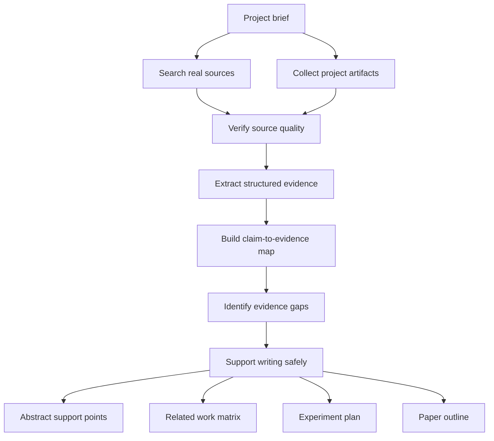

# Sopaper Evidence


Current version: `v0.3`

Sopaper Evidence is an evidence-first research skill for paper writing. It searches, verifies, and organizes real papers, datasets, benchmarks, case studies, and project artifacts before supporting any abstract, related work section, experiment plan, or draft outline.

This project is designed for teams that want a paper workflow that is useful under reviewer scrutiny. It does not fabricate results, citations, benchmarks, or claims. If evidence is weak or missing, it reports the gap instead of filling it with confident text.

## Why it exists

Most writing-oriented research prompts are good at producing paragraphs and bad at preserving truth. That failure mode is unacceptable for serious paper work.

Sopaper Evidence is built around a stricter workflow:

1. Search and collect real sources
2. Verify which sources are primary and which are not
3. Extract structured evidence
4. Map claims to evidence
5. Identify missing experiments and unsupported conclusions
6. Support writing only after the evidence pack is sound

## Who this is for

- research engineers turning projects into papers
- robotics and embodied systems teams that need fair comparisons
- founders and labs that want paper support without weak citations or unsupported claims
- OpenClaw-style projects where method, benchmark, and evidence must stay tightly aligned

## What you get

- an evidence-first skill with clear hard rules
- structured references and templates
- an OpenClaw end-to-end example set
- marketplace-ready copy and packaging
- a repository that can act as the public source of truth

## What makes it different

- Evidence-first, not prose-first
- Explicit source priority and claim audits
- Safe handling of uncertainty and missing evidence
- Useful for OpenClaw, robotics, embodied AI, and adjacent research projects
- Strong enough to support paper planning without inventing facts

## Architecture



The key design choice is that writing sits at the end of the pipeline, not the beginning.

## How it works

1. Start from a concrete project brief.
2. Search prior work, datasets, benchmarks, and case studies.
3. Pull in local project artifacts such as runs, tables, and configs.
4. Verify what is primary evidence and what is only a lead.
5. Convert evidence into structured entries.
6. Map every serious claim to explicit support.
7. Report missing evidence before drafting.
8. Generate only conservative, evidence-backed writing outputs.

## Input / Output

### Typical input

- project name and one-paragraph summary
- research problem and intended contribution
- target venue or paper style if known
- local artifact paths for results, notes, configs, or tables
- constraints such as "do not assume unsupported benchmark wins"

### Typical output

- evidence brief
- prior-work search plan
- related work matrix
- claim-to-evidence map
- evidence gap report
- paper outline built only from supported evidence

### Example prompt shape

```text
Build an evidence pack for OpenClaw. Search real prior work, benchmarks, datasets, and case studies, use local artifacts when available, map claims to evidence, identify unsupported conclusions, and produce a conservative paper outline.
```

## Repository layout

```text
.
├── README.md
├── LICENSE
└── sopaper-evidence/
    ├── SKILL.md
    ├── agents/openai.yaml
    ├── assets/
    ├── examples/
    └── references/
```

## Skill contents

- [SKILL.md](/Users/xu/Desktop/Sopaper/sopaper-evidence/SKILL.md): core workflow and hard rules
- [evidence-schema.md](/Users/xu/Desktop/Sopaper/sopaper-evidence/references/evidence-schema.md): how evidence is structured
- [claim-audit-rules.md](/Users/xu/Desktop/Sopaper/sopaper-evidence/references/claim-audit-rules.md): checks before any writing support
- [source-priority.md](/Users/xu/Desktop/Sopaper/sopaper-evidence/references/source-priority.md): source quality policy
- [prior-work-search-playbook.md](/Users/xu/Desktop/Sopaper/sopaper-evidence/references/prior-work-search-playbook.md): how to search prior work without drifting into weak evidence
- [openclaw-evidence-playbook.md](/Users/xu/Desktop/Sopaper/sopaper-evidence/references/openclaw-evidence-playbook.md): OpenClaw-specific evidence workflow for robotics and embodied systems papers
- [benchmark-baseline-checklist.md](/Users/xu/Desktop/Sopaper/sopaper-evidence/references/benchmark-baseline-checklist.md): how to validate evaluation fit and baseline quality
- [evidence-gap-triage.md](/Users/xu/Desktop/Sopaper/sopaper-evidence/references/evidence-gap-triage.md): how to prioritize blockers before drafting
- [claim-evidence-map-template.md](/Users/xu/Desktop/Sopaper/sopaper-evidence/assets/claim-evidence-map-template.md): reusable template
- [related-work-matrix-template.md](/Users/xu/Desktop/Sopaper/sopaper-evidence/assets/related-work-matrix-template.md): structured comparison template for related work
- [paper-outline-from-evidence-template.md](/Users/xu/Desktop/Sopaper/sopaper-evidence/assets/paper-outline-from-evidence-template.md): conservative outline template that starts from verified evidence
- [experiment-gap-report-template.md](/Users/xu/Desktop/Sopaper/sopaper-evidence/assets/experiment-gap-report-template.md): template for triaging missing experiments and blocked claims

## Example workflow

See the OpenClaw example set:

- [openclaw-input.md](/Users/xu/Desktop/Sopaper/sopaper-evidence/examples/openclaw-input.md)
- [openclaw-search-plan.md](/Users/xu/Desktop/Sopaper/sopaper-evidence/examples/openclaw-search-plan.md)
- [openclaw-evidence-brief.md](/Users/xu/Desktop/Sopaper/sopaper-evidence/examples/openclaw-evidence-brief.md)
- [openclaw-claim-map.md](/Users/xu/Desktop/Sopaper/sopaper-evidence/examples/openclaw-claim-map.md)
- [openclaw-gap-report.md](/Users/xu/Desktop/Sopaper/sopaper-evidence/examples/openclaw-gap-report.md)
- [openclaw-paper-outline.md](/Users/xu/Desktop/Sopaper/sopaper-evidence/examples/openclaw-paper-outline.md)

These examples show the intended quality bar:

- factual inputs
- explicit assumptions
- conservative wording
- claim-to-evidence traceability
- clear evidence gaps before paper drafting

## Showcase

The OpenClaw example chain shows how Sopaper Evidence should be used in practice:

1. Start with a scoped project brief in [openclaw-input.md](/Users/xu/Desktop/Sopaper/sopaper-evidence/examples/openclaw-input.md)
2. define a disciplined retrieval plan in [openclaw-search-plan.md](/Users/xu/Desktop/Sopaper/sopaper-evidence/examples/openclaw-search-plan.md)
3. convert findings into a conservative evidence pack in [openclaw-evidence-brief.md](/Users/xu/Desktop/Sopaper/sopaper-evidence/examples/openclaw-evidence-brief.md)
4. gate all important claims through [openclaw-claim-map.md](/Users/xu/Desktop/Sopaper/sopaper-evidence/examples/openclaw-claim-map.md)
5. triage blocker gaps in [openclaw-gap-report.md](/Users/xu/Desktop/Sopaper/sopaper-evidence/examples/openclaw-gap-report.md)
6. only then shape a paper-safe structure in [openclaw-paper-outline.md](/Users/xu/Desktop/Sopaper/sopaper-evidence/examples/openclaw-paper-outline.md)

This is the intended usage pattern: evidence first, draft support second.

## Quick start

Point the skill at a project and ask it to produce:

1. an evidence brief
2. a prior-work search plan
3. a related work matrix
4. a claim-to-evidence map
5. a paper outline built only from supported evidence

The default output should stay conservative. If a result, comparison, or citation cannot be defended, the correct output is to mark the gap instead of stretching the claim.

## Recommended README completeness

For a strong public repository, these sections matter most:

- cover image or visual identity
- one clear architecture diagram
- one end-to-end example
- quick start
- repository layout
- trust model and hard rules
- release or marketplace links

This README now has the core structure for a strong public repository.

## Why not use a normal writing prompt

Normal writing prompts optimize for fluent text. Sopaper Evidence optimizes for defensible claims.

The difference is structural:

- normal prompts often start with drafting
- Sopaper Evidence starts with source search and evidence verification
- normal prompts can blur facts, guesses, and missing data
- Sopaper Evidence separates `verified_fact`, `project_evidence`, `inference`, and `unverified`
- normal prompts tend to smooth over evidence gaps
- Sopaper Evidence treats gaps as first-class output

## Release assets

Use these files when publishing or presenting the project:

- [marketplace-listing.md](/Users/xu/Desktop/Sopaper/sopaper-evidence/assets/marketplace-listing.md)
- [github-launch.md](/Users/xu/Desktop/Sopaper/docs/github-launch.md)
- [marketplace-launch.md](/Users/xu/Desktop/Sopaper/docs/marketplace-launch.md)
- [repo-settings.md](/Users/xu/Desktop/Sopaper/docs/repo-settings.md)
- [marketplace-publish-checklist.md](/Users/xu/Desktop/Sopaper/docs/marketplace-publish-checklist.md)
- [release-v0.2.0.md](/Users/xu/Desktop/Sopaper/docs/release-v0.2.0.md)

## Publishing guidance

Use GitHub as the source of truth and publish the skill package from [sopaper-evidence](/Users/xu/Desktop/Sopaper/sopaper-evidence) to any supported skill marketplace. The public listing should link back to this repository so users can inspect the rules, examples, and provenance expectations.

For marketplace descriptions, emphasize:

- evidence-first research workflow
- no fabricated results or citations
- claim-to-evidence mapping
- useful for OpenClaw-style paper development

## Quality bar

This project should be judged by whether it prevents bad research writing, not by whether it generates more text.

The correct behavior is:

- stop when evidence is weak
- ask for missing artifacts
- narrow claims when support is partial
- keep outputs reviewable and auditable

## Roadmap

### v0.3

- OpenClaw-specific evidence playbook
- evidence-gap triage for blocker decisions
- experiment gap report template and example

### v0.4

- lightweight helper scripts for evidence table generation
- more reusable templates for rebuttal and reviewer-safe summaries
- better packaging for installation and discovery

## Suggested GitHub metadata

- Repository name: `sopaper-evidence`
- Description: `Evidence-first research skill for paper writing. Search, verify, and organize real papers, benchmarks, datasets, case studies, and project artifacts without unsupported claims.`
- Suggested topics: `research`, `paper-writing`, `evidence`, `literature-review`, `robotics`, `embodied-ai`, `openclaw`, `skills`

## License

Released under the MIT License. See [LICENSE](/Users/xu/Desktop/Sopaper/LICENSE).
