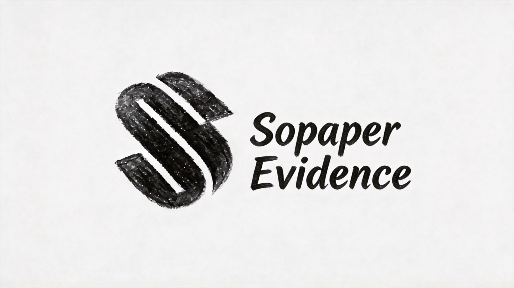
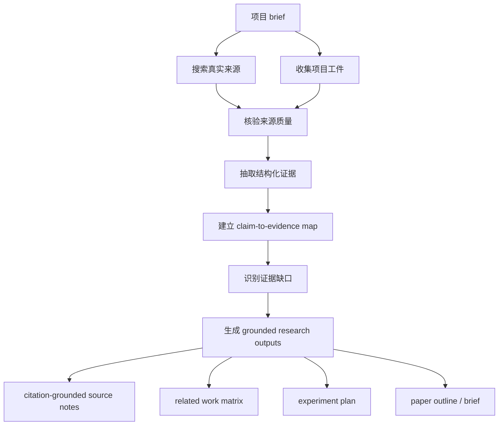

# Sopaper Evidence



[English](README.md) | [简体中文](README.zh-CN.md)

当前版本：`v1.1.1`

Sopaper Evidence 是一个以证据优先为核心的研究型 skill，用于证据发现、来源核验与引用落地。它会在任何下游写作或研究规划开始之前，先搜索、验证并组织真实论文、数据集、benchmark、案例和项目工件。

这个项目面向需要经得起 reviewer 审视的研究团队。它不会虚构结果、引用、benchmark 或 claim；如果证据不足，它会明确报告缺口，而不是用看起来流畅但站不住脚的文字去补齐。

## 为什么存在

大多数偏写作导向的研究 prompt 很擅长生成段落，但不擅长守住事实边界。对严肃研究来说，这个失败模式是不能接受的。

Sopaper Evidence 的工作流更严格：

1. 搜索并收集真实来源
2. 区分哪些是一手来源，哪些只是线索
3. 抽取结构化证据
4. 建立 claim-to-evidence map
5. 识别缺失实验和不被支持的结论
6. 只有在 evidence pack 成形后，才支持下游写作

## 适合谁

- 需要把项目整理成有证据支撑研究叙事的研究工程师
- 需要做公平 benchmark / baseline 对比的机器人、具身智能团队
- 希望获得研究支持，但又不接受弱引用和无根据结论的团队或创始人
- 像 OpenClaw 这样方法、benchmark 与证据必须紧密绑定的项目

## 现在具备的能力

- 证据优先、边界明确的 skill
- 更强的输入 schema：claims、source notes、result artifacts
- references、templates、examples 配套完整
- evidence ledger 自动草稿生成
- claim-to-evidence map 自动初始化
- evidence gap triage 自动草稿生成
- topic-first 的搜索、抓取、保守验证与 evidence pack 生成
- 结构化 result artifact 接入，可用于 comparative claim 判断
- reviewed primary-source summaries，可把外部来源提升到比页面级元信息更强的研究级摘要
- 可直接接入 `.csv / .tsv / .json` 结果工件，不需要先手写 markdown 包装
- 可融合多份结果工件，自动生成更强的 aggregate `project_evidence`
- 可递归扫描实验结果目录，自动发现原始 `.csv / .tsv / .json` 结果文件并送入 evidence pipeline
- 支持常见 metric 名称规范化，结果证据更可读、更稳定
- 外部抓取前会进行公网 URL 安全检查，拒绝 localhost、内网、link-local 和带账号密码的 URL
- 自带独立 fairness review，会从 direct evidence、baseline breadth、metric grounding、scope alignment 角度判断比较是否公平
- OpenClaw 端到端示例链路
- 可用于 GitHub / ClawHub 发布的打包与文案

## 和普通写作工具有什么不同

- 它是 evidence-first，不是 prose-first
- 它显式区分来源优先级与证据等级
- 它会保守处理不确定信息，而不是自动圆过去
- 它适合 OpenClaw、robotics、embodied AI 以及邻近研究主题
- 它的目标不是多写字，而是让研究输出可追溯、可审查、可辩护

## 架构



核心设计点是：把 grounded evidence work 放在整个 pipeline 的最前面，而把任何写作支持严格放到下游。

## 它怎么工作

1. 从清晰的项目 brief 或研究主题开始
2. 搜索 prior work、dataset、benchmark 和 case study
3. 吃进本地项目工件，例如结果表、运行记录、配置和说明
4. 区分哪些是 primary evidence，哪些只是 lead
5. 把证据转成结构化条目
6. 为每个重要 claim 显式匹配支持证据
7. 在起草前先报告缺失证据
8. 只生成保守、可追溯的下游研究输出

## 输入 / 输出

### 常见输入

- 项目名称和一段摘要
- 研究问题和预期贡献
- 目标 venue 或论文风格
- 本地结果、笔记、配置、表格等路径
- 约束条件，例如“不要假设 benchmark 胜出”

### 常见输出

- evidence brief
- prior-work search plan
- related work matrix
- claim-to-evidence map
- evidence gap report
- 仅建立在已支持证据上的 citation-grounded research outputs

### 示例 prompt

```text
为 OpenClaw 构建一个 evidence pack。搜索真实的 prior work、benchmark、dataset 和 case study，尽量使用本地项目工件，把 claims 映射到证据，识别不被支持的结论，并生成 citation-grounded research outputs。
```

## 仓库结构

```text
.
├── README.md
├── README.zh-CN.md
├── LICENSE
├── scripts/
└── sopaper-evidence/
    ├── SKILL.md
    ├── agents/openai.yaml
    ├── assets/
    ├── examples/
    ├── scripts/
    └── references/
```

## Skill 内容

- [SKILL.md](/Users/xu/Desktop/Sopaper/sopaper-evidence/SKILL.md)：核心工作流和硬规则
- [evidence-schema.md](/Users/xu/Desktop/Sopaper/sopaper-evidence/references/evidence-schema.md)：证据结构规范
- [claim-audit-rules.md](/Users/xu/Desktop/Sopaper/sopaper-evidence/references/claim-audit-rules.md)：任何写作支持前必须过的审查规则
- [source-priority.md](/Users/xu/Desktop/Sopaper/sopaper-evidence/references/source-priority.md)：来源质量策略
- [input-schemas.md](/Users/xu/Desktop/Sopaper/sopaper-evidence/references/input-schemas.md)：source notes、claims、result artifacts 的结构化输入规范
- [openclaw-evidence-playbook.md](/Users/xu/Desktop/Sopaper/sopaper-evidence/references/openclaw-evidence-playbook.md)：OpenClaw / robotics 专项证据工作流
- [benchmark-baseline-checklist.md](/Users/xu/Desktop/Sopaper/sopaper-evidence/references/benchmark-baseline-checklist.md)：benchmark fit 和 baseline quality 检查清单
- [evidence-gap-triage.md](/Users/xu/Desktop/Sopaper/sopaper-evidence/references/evidence-gap-triage.md)：证据缺口优先级判断

## 示例链路

可以直接看 OpenClaw 示例：

- [openclaw-input.md](/Users/xu/Desktop/Sopaper/sopaper-evidence/examples/openclaw-input.md)
- [openclaw-search-plan.md](/Users/xu/Desktop/Sopaper/sopaper-evidence/examples/openclaw-search-plan.md)
- [openclaw-evidence-brief.md](/Users/xu/Desktop/Sopaper/sopaper-evidence/examples/openclaw-evidence-brief.md)
- [openclaw-claim-map.md](/Users/xu/Desktop/Sopaper/sopaper-evidence/examples/openclaw-claim-map.md)
- [openclaw-gap-report.md](/Users/xu/Desktop/Sopaper/sopaper-evidence/examples/openclaw-gap-report.md)
- [openclaw-result-artifact.md](/Users/xu/Desktop/Sopaper/sopaper-evidence/examples/openclaw-result-artifact.md)

这套示例体现的质量标准是：

- 输入尽量事实化
- 假设显式写出
- 结论措辞保守
- claim 和 evidence 可追溯
- 在下游起草前先暴露 evidence gaps

## 快速开始

把 skill 指向一个项目或研究主题，要求它产出：

1. evidence brief
2. prior-work search plan
3. related work matrix
4. claim-to-evidence map
5. 仅基于已支持证据的 citation-grounded outputs

默认输出应保持保守。如果一个结果、对比或引用无法被辩护，正确行为是标记 gap，而不是硬把 claim 写大。

## 脚本工作流

这套 helper scripts 现在可以自动完成前三个机械步骤：

1. 生成 evidence ledger 草稿
2. 初始化 claim-to-evidence map
3. 生成 blocker / major / minor 的 evidence gap report
4. 在保留 comparative 语言前先做 fairness review

结构化 source notes 和 result artifacts 会显著减少 placeholder-only 草稿；当本地 result artifact 包含直接结果、metric 和 baseline 上下文时，comparative claim 可以从 `unsupported` 提升到更高置信度。

如果输入里只有原始 URL，外部抓取工具会先把它们转成结构化 source-note 草稿；保守验证阶段会把足够清晰的来源升级为页面级事实，或进一步合成为 reviewed primary-source summary，再进入 ledger。

如果用户只给一个研究主题，topic-driven pipeline 会自动生成：

- search plan
- candidate claims
- searched source list
- fetched source-note drafts
- downstream evidence pack

如果还提供了结构化 result artifacts，同一条 pipeline 也能把它们并入 `project_evidence`，用于 comparative-result gating。

现在这条 result-artifact 链路已经不只支持 markdown 模板，也支持直接接入 `.csv / .tsv / .json` 结果文件，并自动抽 metric、baseline 和 scope 信号。

当同时提供多份结果工件时，ledger 还会自动生成一条聚合后的 project evidence，便于下游 claim map 和 gap triage 使用更强的项目级证据面。

真实实验目录可以直接用 `--result-dir` 接入，pipeline 会递归发现 `.csv / .tsv / .json` 结果文件，不需要逐个手动列出。

查看完整命令流程：
- [automation-workflow.md](/Users/xu/Desktop/Sopaper/docs/automation-workflow.md)

一条命令跑完整 evidence pipeline：

```bash
python3 scripts/run_evidence_pipeline.py \
  --sources sopaper-evidence/examples/openclaw-source-list.md \
  --claims sopaper-evidence/examples/openclaw-claims.md \
  --fetch-external \
  --verify-fetched \
  --output-dir output/openclaw-pipeline
```

topic-first 示例：

```bash
python3 scripts/run_topic_evidence_pipeline.py \
  "citation-grounded retrieval for code assistants" \
  --output-dir output/topic-rag-citations
```

带结构化 result artifact 的 topic-first 示例：

```bash
python3 scripts/run_topic_evidence_pipeline.py \
  "OpenClaw long-horizon manipulation benchmark evaluation" \
  --result-artifacts sopaper-evidence/examples/openclaw-result-artifact.md \
  --output-dir output/topic-openclaw
```

直接使用 CSV 结果工件的 topic-first 示例：

```bash
python3 scripts/run_topic_evidence_pipeline.py \
  "OpenClaw long-horizon manipulation benchmark evaluation" \
  --result-artifacts sopaper-evidence/examples/openclaw-results.csv \
  --output-dir output/topic-openclaw-csv
```

直接接入结果目录的 topic-first 示例：

```bash
python3 scripts/run_topic_evidence_pipeline.py \
  "OpenClaw long-horizon manipulation benchmark evaluation" \
  --result-dir sopaper-evidence/examples/openclaw-results-dir \
  --output-dir output/topic-openclaw-results-dir
```

发布到 ClawHub 的 skill bundle 已经包含 `sopaper-evidence/scripts/` 下的 helper scripts，因此线上包与 `SKILL.md` 中的运行说明是一致的。

## 信任模型

- 不虚构论文、作者、venue、benchmark、dataset、实验或数值结果
- 优先使用 primary source
- 清楚区分 `verified_fact`、`project_evidence`、`inference` 和 `unverified`
- 如果证据不足，先报 gap，不强行生成结论
- 所有写作型输出都应能追溯到 evidence items

## License

本项目使用 [LICENSE](/Users/xu/Desktop/Sopaper/LICENSE) 中定义的 MIT-0 许可证。
